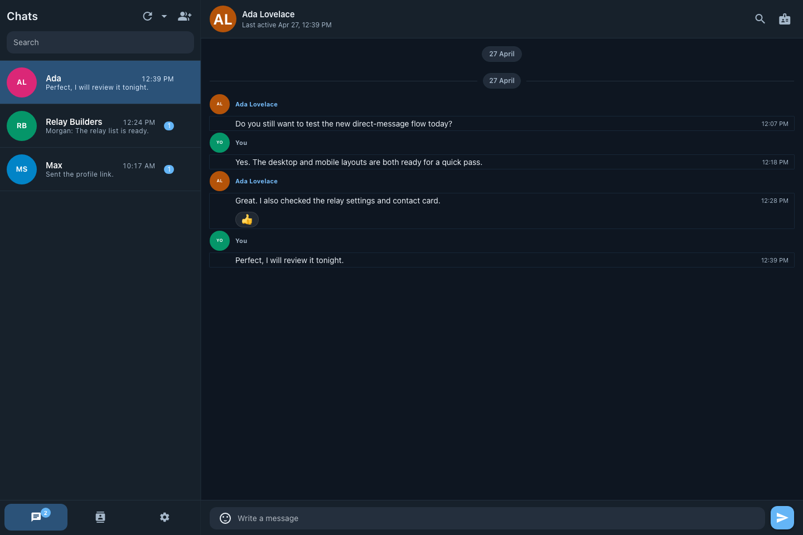
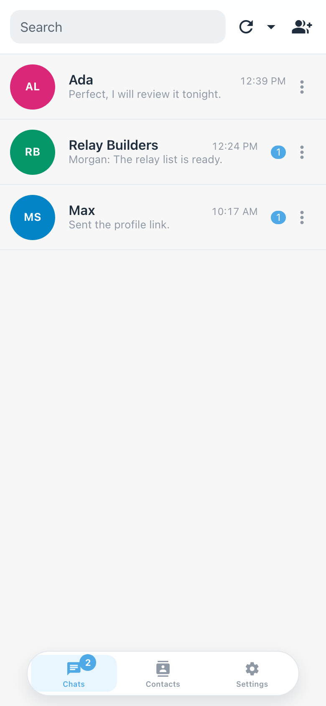
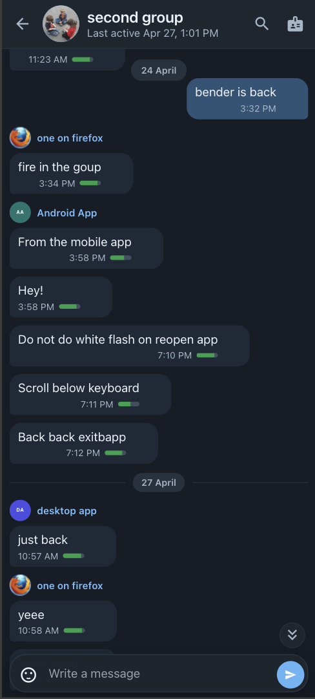

# Nostr Chat

Nostr Chat is a private messaging app for Nostr. It gives you a clean place to talk one-to-one or in groups, manage contacts, and choose the relays your messages use.

## Screenshots

**Desktop**

**Mobile**

  &nbsp;&nbsp;&nbsp;&nbsp;
  &nbsp;&nbsp;&nbsp;&nbsp;
  &nbsp;&nbsp;&nbsp;&nbsp;&nbsp;&nbsp;&nbsp;&nbsp;
  

## What You Can Do

- Create a new Nostr account or sign in with an existing one.
- Chat privately with individual contacts.
- Create and join group conversations.
- Review new contact requests before accepting, blocking, or deleting them.
- Search chats, react to messages, delete messages, and keep track of unread conversations.
- Manage your contacts, profile, relays, theme, and notification preferences.
- Use the app on desktop-sized screens or mobile-sized screens.

## Development

Technical setup, build commands, protocol notes, project structure, and testing details live in [DEV.md](./DEV.md).
